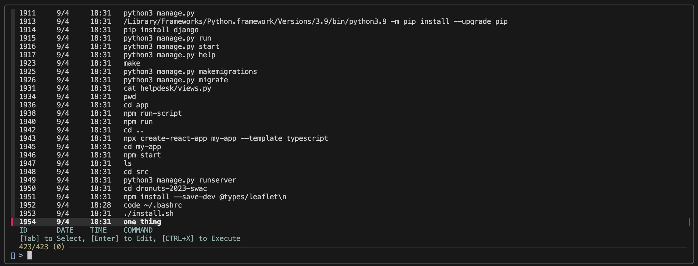
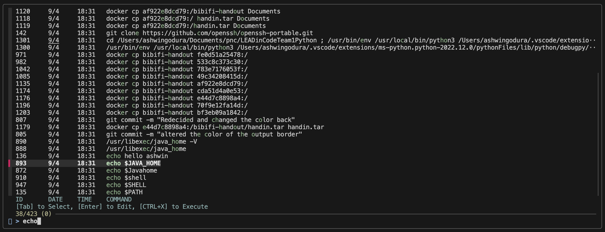
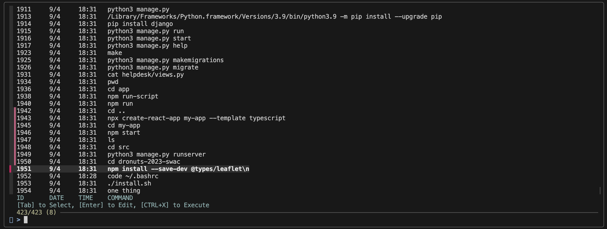

# Zsh History Viewer

## Overview

This script enhances your Zsh command line by replacing the default history search with a powerful, full-screen, interactive UI powered by fzf. It works as a seamless plugin for Oh My Zsh or as a standalone script for a standard Zsh setup. It allows you to instantly search, select, and act upon your command history with an intuitive and efficient workflow.

---

## Features

-   **Universal Compatibility**: A smart installer automatically detects your environment and sets up the script for either Oh My Zsh or standard Zsh.
-   **Enhanced History View**: Displays your history in a clean, columnar format with the command ID, date (MM/DD), time, and the command itself.
-   **Pre-filled Search Query**: Pressing `Ctrl+L` automatically uses any text you've already typed in your prompt as the initial search query.
-   **Fuzzy Search**: Instantly filter through your history by typing any part of a command.
-   **Duplicate Command Filtering**: The list is automatically decluttered by showing only the most recent invocation of any duplicate command.
-   **Multi-Command Select**: Use the `Tab` key to select multiple commands. When you're done, they will all be placed in your prompt, ready for execution.
-   **Dual-Mode Operation**:
    -   **Edit Mode**: Press `Enter` to select a command (or multiple) and place it on your command line for editing.
    -   **Execute Mode**: Press `Ctrl+X` to select and immediately run a command.

---

## Requirements

-   **Zsh**: The Zsh shell.
-   **fzf**: A command-line fuzzy finder. This is a hard requirement.

---

## Installation

This project includes a powerful installer script to automate the entire setup process.

1.  Place both `install.sh` and the script file (`history-viewer.zsh`) in the same directory.
2.  Make the installer script executable:
    ```sh
    chmod +x install.sh
    ```
3.  Run the installer:
    ```sh
    ./install.sh
    ```

The script will automatically detect your environment (Oh My Zsh or standard Zsh), check for dependencies, copy the files to the correct location, and update your `.zshrc` file.

#### Installation Options:

-   **Force Standard Installation**: If you have Oh My Zsh but want to install the script using the standard method, use the `--force` flag.
    ```sh
    ./install.sh --force
    ```

#### Uninstallation:

-   To completely remove the script and its configuration from your system, run the installer with the `--uninstall` flag.
    ```sh
    ./install.sh --uninstall
    ```

**Note**: After installing or uninstalling, you must restart your terminal or run `source ~/.zshrc` to apply the changes.

---

## Usage

-   **Open the Viewer**: Press `Ctrl+L` in your terminal. If you have text in your prompt, it will become the initial search.
-   **Search**: Simply start typing to fuzzy-search your history. The list will filter in real-time.
-   **Select for Editing**: Highlight a command and press `Enter`. The UI will close, and the command will be placed on your command line.
-   **Select Multiple Commands**: Use `Tab` to highlight multiple commands. Press `Enter` when you are done to place all of them in your prompt, separated by newlines.
-   **Execute Directly**: Highlight a command and press `Ctrl+X`. The UI will close, and the command will be executed immediately. (Note: This is not recommended for multi-select).
-   **Cancel**: Press `Esc` or `Ctrl+C` to close the viewer at any time without selecting a command.


## Images

- ### Menu
    
- ### Searching
    
- ### Selecting Multiple Commands
    


